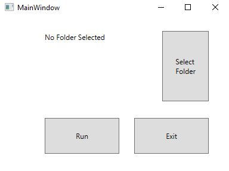

# Unity_Empty-Methods-Stripper
Small C# WPF application to strip Empty methods from Unity projects to enhance performance. This is a WIP, and will only work on Windows (check out the releases), unless I port it to Xamarin.


## Overview  

Unity calls GameObjects'  callbacks (such as Update and Start) even when they are empty, as long as they are defined, which eats into the frame budget. What's more they are not stripped when compiling to release. The problem is that they are part of the boilerplate of creating a new Class so it is possible to forget them. 

This repo is a simple utility written in C# that gets all .cs files in a folder and its subfolders, strips ALL empty methods from the input string and writes back to the files. Select a folder, click run, and you're done!   





WARNING:

This is a WIP, and files will be overwritten. It is distributed under MIT which means I am not responsible in case anything goes wrong.  

It should work, but take care: save a copy of your code before running this.


## How?  

I use the following Regular Expressions, if you want to do your own utility:

```csharp
 @"private void (?<word>\w+)\(\)*\s*\{*\s*\n*\}"
 @"void (?<word>\w+)\(\)*\s*\{*\s*\n*\}"
```


The software reads a file, matches and replace on the previously defined Regular Expressions. All empty methods will be deleted.  


## Releases  

v1.0 is out, enables folder selection. Will perform recursive search and in-place regex matching and deletion of empty methods.   

[Get the releases here](https://github.com/Wally869/Unity_Empty-Methods-Stripper/releases)


